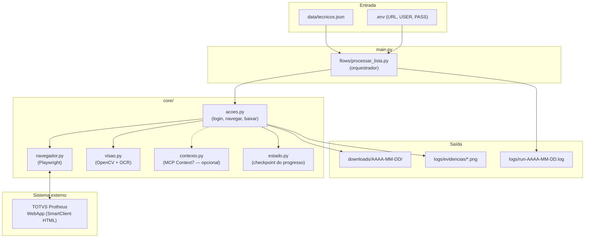
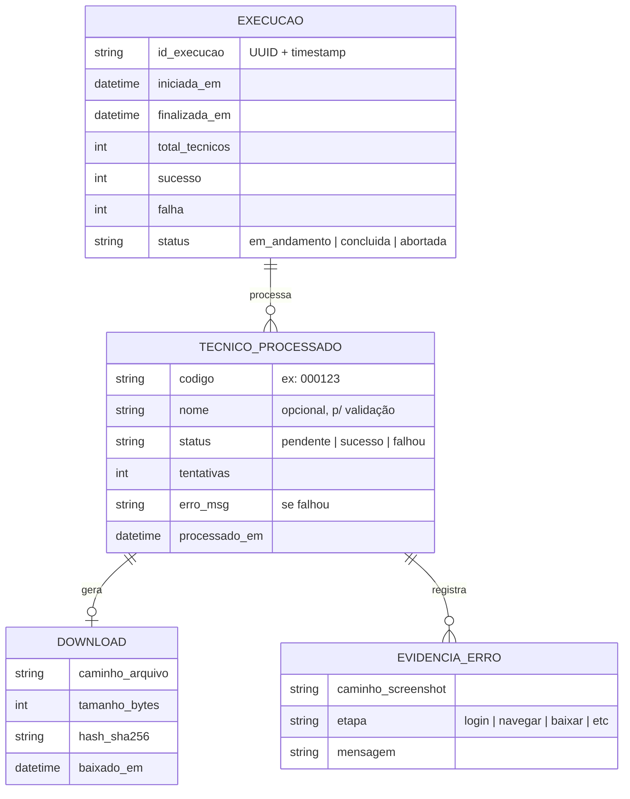
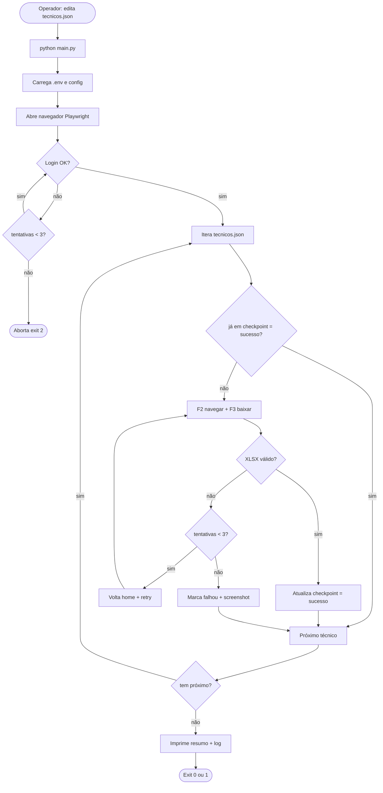
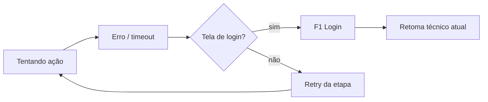

# PRD — Robô TOTVS Protheus (Download "Mat. Estoque por Técnico")

> **Documento de requisitos do produto (PRD)**
> Fonte única de verdade. Toda decisão técnica, sprint ou prompt subsequente deve referenciar este arquivo.
> **Versão:** 1.5 — 2026-05-02
> **Autor:** Ludson Francisco
> **Status:** MVP Funcional (Sprints 1-5 Concluídas)

---

## 1. Visão Geral do Produto

**Nome:** robo-totvs (RPA Protheus — Estoque por Técnico)

**Resumo (1 frase):** Robô em Python + Playwright que automatiza, no TOTVS Protheus WebApp, o download em XLSX do relatório "Material em Estoque por Técnico" para uma lista de técnicos definida em JSON.

**Status Atual:**
O projeto atingiu a maturidade do MVP, com os fluxos de login, navegação, download individual e processamento em lote (loop com checkpoint) totalmente implementados e validados. O robô já é capaz de realizar a operação ponta-a-ponta de forma resiliente.

**Conquistas Técnicas Recentes:**
1.  **Estabilização Visual**: Implementação de viewport fixa (1366x768) e multi-scale matching para garantir que o sistema de visão computacional funcione em diferentes ambientes.
2.  **Navegação de IFrames**: Desenvolvimento de lógica recursiva para localizar elementos em frames dinâmicos do SmartClient HTML.
3.  **Dropdown de Planilha**: Superação do bloqueio de cliques no Canvas através da manipulação direta do elemento `<select>` no DOM do IFrame, garantindo 100% de precisão na escolha do formato XLSX.
4.  **Integridade do Download**: Interceptação nativa do evento de download pelo Playwright, seguida de validação de integridade (ZIP Check) e cálculo de hash SHA-256.
5.  **Idempotência**: Sistema de checkpoint em JSON que permite retomar execuções interrompidas sem duplicar downloads.

**Problema que resolve:**
A operação atual é 100% manual: o operador faz login no Protheus, navega até Favoritos → "Mat Estoque Por Tecnico", insere o código de cada técnico, escolhe o formato XLSX, clica em "Imprimir" e baixa o arquivo. Para uma lista com N técnicos, são ~10 cliques por item × N + erros humanos + tempo ocioso esperando o sistema responder. O Protheus WebApp roda em SmartClient HTML com uso intensivo de Canvas, IDs ofuscados e iFrames — o que dificulta automações tradicionais baseadas em DOM.

**Objetivo do MVP:**
Rodar todos os dias (ou sob demanda) um job que:
1. Abra o Protheus, faça login.
2. Navegue até a rotina-alvo.
3. Para cada técnico do JSON de entrada, baixe o XLSX.
4. Volte ao ponto inicial e processe o próximo, até o fim.
5. Gere logs estruturados e organize os arquivos baixados.

**Não-objetivos (fora do escopo do MVP):**
- ❌ Containerização (Docker) — pode entrar em fase 2.
- ❌ Testes automatizados (unit/integration) — fase 2.
- ❌ Interface gráfica de configuração — operação por CLI/JSON.
- ❌ Distribuir relatórios por email/Slack — fase 2.
- ❌ Multiusuário ou multi-tenant — apenas 1 conta Protheus.
- ❌ Modificar dados no Protheus (write) — operação é **read-only / export-only**.

**Frequência esperada de execução:** diária (manual ou via cron), ~30–200 técnicos por execução.

---

## 2. Público-Alvo

| Persona | Papel | Necessidade | Como interage com o robô |
|---|---|---|---|
| **Operador de Logística / Almoxarifado** | Quem hoje faz o download manual | Reduzir 2–4h/dia de trabalho repetitivo | Edita `data/tecnicos.json`, executa `python main.py`, recebe XLSX organizados em `downloads/AAAA-MM-DD/` |
| **Analista de Dados / BI** | Consome os XLSX gerados | Receber arquivos em horário previsível e nomenclatura consistente | Lê arquivos baixados; não interage diretamente com o robô |
| **Desenvolvedor (mantenedor)** | Mantém o robô | Diagnóstico rápido quando o Protheus muda layout | Lê `logs/`, ajusta seletores/imagens em `core/visao/` |

**Restrições do usuário-alvo (Operador):**
- Não é desenvolvedor: precisa rodar com 1 comando.
- Conhece os códigos dos técnicos.
- Pode editar JSON simples.

---

## 3. Arquitetura do Sistema

### 3.1 Stack escolhida

| Camada | Tecnologia | Versão mínima | Justificativa |
|---|---|---|---|
| Linguagem | Python | 3.11+ | Maturidade, ecossistema RPA, async nativo |
| Automação navegador | **Playwright (Python)** | `playwright>=1.49.0` | Suporte robusto a iFrames, espera inteligente (`wait_for_state`), interceptação de download, cross-browser, headed/headless |
| Computer Vision (fallback) | OpenCV + template matching | `opencv-python>=4.10.0` | Para Canvas / elementos não-DOM; matching com prints de `referencias/` |
| OCR (último recurso) | Tesseract via `pytesseract` | `pytesseract>=0.3.13` | Quando matching falha e precisamos ler texto de Canvas |
| Logging | `loguru` | `loguru>=0.7.2` | Estruturado, colorido, rotação de arquivos com 1 linha de config |
| Config | `python-dotenv` + `pydantic-settings` | `pydantic-settings>=2.6.0` | Validação de env vars (URL, USER, PASS) com tipo |
| Retry | `tenacity` | `tenacity>=9.0.0` | Decorators de retry com backoff exponencial |
| Captura de tela (debug) | Playwright nativo | — | Evidência de erro em cada falha |

> **Regra de versionamento (IA):** ao gerar código, sempre use as versões mínimas acima. Não invente bibliotecas fora desta lista sem justificar.

### 3.2 Diagrama de arquitetura (Mermaid)



### 3.3 Princípios arquiteturais

1. **Estratégia híbrida em 3 camadas, sempre nesta ordem:**
   - **DOM (Playwright locators)** → preferência absoluta quando elemento é HTML acessível (login form, header geral).
   - **Computer Vision (template matching)** → quando elemento está em Canvas (a maior parte do Protheus): clique por coordenada após `match` em screenshot.
   - **OCR** → último recurso para ler valores variáveis dentro de Canvas (ex.: validar nome do técnico que apareceu).

2. **Espera inteligente, nunca `sleep` cego:**
   - Para DOM: `page.wait_for_selector(..., state="visible")`.
   - Para Canvas: polling de template matching com timeout (`aguardar_imagem(path, timeout=15)`).
   - `sleep` fixo só é permitido para janelas conhecidamente longas e estáveis (ex.: post-download de 7s observado no fluxo manual — passo 18).

3. **Retry com backoff por etapa, não por execução inteira:**
   - Cada ação atômica (clicar, digitar, baixar) tem 3 tentativas com `tenacity`.
   - Se etapa falha após retry → captura screenshot, registra erro, marca técnico como "falhou", continua próximo.

4. **Idempotência por técnico:**
   - Estado salvo em `state/checkpoint.json` após cada técnico processado.
   - Re-execução pula técnicos já baixados no mesmo dia (ou conforme flag `--retry-falhos`).

5. **Sessão como cidadão de primeira classe:**
   - Detecção de logout (URL ou screenshot da tela de login) em todo retry.
   - Re-login automático e retomada do técnico atual.

6. **Não há multi-tenancy nem usuários múltiplos** — 1 robô, 1 conta Protheus.

---

## 4. Modelo de Dados

Não há banco de dados. Os dados ficam em arquivos JSON simples.

### 4.1 Diagrama (entidades lógicas)



### 4.2 Entrada — `technicians.json` (raiz do projeto)

> **Artefato real já disponível no repositório:** `technicians.json` (na raiz, não em `data/`).
> O campo usado pelo robô como entrada do filtro Protheus é **`code`** (ex.: `"HK"`, `"8Q"`, `"2S"`).
> Os campos `name`, `login`, `status` e `email` são metadados; `name` é usado pela validação OCR opcional (passo F3.3) e `status` pode ser usado para filtrar apenas `Ativo`.

```json
[
  { "code": "HK", "name": "ALEXANDRE MENEZES DE SOUZA - DMAIS (VAREJO)", "login": "ALEXANDRE MENEZES DE SOUZA - DMAIS (VAREJO)", "status": "Ativo", "email": "alexandre.souza@dmais.com.br" },
  { "code": "8Q", "name": "CLAUDIO OLIVEIRA DE MORAIS - DMAIS (VAREJO)", "login": "CLAUDIO OLIVEIRA DE MORAIS - DMAIS (VAREJO)", "status": "Ativo", "email": "claudio.morais@dmais.com.br" },
  { "code": "DJ", "name": "LOGISTICA VVA", "login": "", "status": "Ativo", "email": "" }
]
```

| Campo | Tipo | Obrigatório | Observação |
|---|---|---|---|
| `code` | string | ✅ | Código do técnico no Protheus (formato livre, 2 chars alfanuméricos no dataset atual; tratado como string) |
| `name` | string | ❌ | Se presente, robô valida via OCR que o nome retornado pelo Protheus contém este texto — defesa contra código errado |
| `login` | string | ❌ | Metadado; não usado pelo fluxo de download |
| `status` | string | ❌ | `Ativo` \| `Desligado` — robô deve, por padrão, processar apenas `Ativo` (configurável) |
| `email` | string | ❌ | Metadado; reservado para fase 2 (envio por email) |

> **Compatibilidade com o PRD original:** referências ao caminho `data/tecnicos.json` e aos campos `codigo`/`nome` em outras seções deste documento devem ser lidas como **`technicians.json`** com `code`/`name`. O env var `TECNICOS_JSON` (seção 9.1) tem default atualizado para `technicians.json`.

### 4.3 Saída — checkpoint `state/checkpoint.json`

```json
{
  "id_execucao": "2026-05-01T08:30:00_a1b2c3",
  "iniciada_em": "2026-05-01T08:30:00",
  "finalizada_em": null,
  "tecnicos": [
    { "codigo": "000123", "status": "sucesso", "tentativas": 1, "arquivo": "downloads/2026-05-01/000123_JOAO_DA_SILVA.xlsx" },
    { "codigo": "000456", "status": "falhou", "tentativas": 3, "erro_msg": "timeout aguardando popup de download" },
    { "codigo": "000789", "status": "pendente" }
  ]
}
```

### 4.4 Saída — arquivos baixados

- Diretório: `downloads/AAAA-MM-DD/` (cria automaticamente).
- Convenção de nome: `{codigo}_{nome_normalizado}.xlsx` (ex.: `000123_JOAO_DA_SILVA.xlsx`).
- Validação pós-download: arquivo existe, `> 0 bytes`, extensão `.xlsx`, abre como ZIP válido (XLSX é ZIP).

---

## 5. Apps / Módulos

Estrutura de pastas (Python, sem framework web):

```
robo-totvs/
├── core/
│   ├── __init__.py
│   ├── navegador.py        # boot Playwright, contexto, downloads, screenshots
│   ├── acoes.py            # ações de alto nível (login, navegar_favorito, selecionar_tecnico, baixar_xlsx)
│   ├── visao.py            # template matching (OpenCV) + OCR (Tesseract)
│   ├── contexto.py         # integração opcional com MCP Context7
│   ├── estado.py           # leitura/escrita do checkpoint.json
│   ├── config.py           # pydantic-settings: env vars + paths
│   └── log.py              # configuração loguru centralizada
│
├── flows/
│   └── processar_lista.py  # orquestrador: lê JSON, chama ações, atualiza estado
│
├── data/
│   └── tecnicos.json       # entrada (lista de técnicos)
│
├── referencias/            # prints com setas — usados para template matching
│   ├── 01_link_de_acesso(.png)
│   ├── 02_clicar_ok.png
│   ├── ... 18_aguarde_7seg_e_voltara_para_o_passo_07.png
│
├── downloads/              # XLSX baixados (criado em runtime, gitignored)
│   └── AAAA-MM-DD/
│
├── state/                  # checkpoint.json (gitignored)
│
├── logs/                   # logs estruturados + screenshots de erro (gitignored)
│   ├── run-AAAA-MM-DD.log
│   └── evidencias/
│
├── .env.example            # URL, USER, PASS — sem secrets
├── .gitignore
├── requirements.txt
├── README.md
└── main.py                 # ponto de entrada CLI
```

---

## 6. Funcionalidades Detalhadas

### 6.1 F1 — Inicialização e Login Resiliente

**Descrição:** Abrir Protheus, dispensar popups iniciais e autenticar com credenciais de `.env`.

**Fluxo (mapeado às referências):**
1. Abre URL (ref. `01_link_de_acesso`).
2. Aguarda carregamento do SmartClient (loader some / aparece campo de login).
3. Se aparecer popup inicial → clica "OK" (ref. `02_clicar_ok.png`) — via template matching.
4. Insere usuário (ref. `03_insira_usuario.png`).
5. Insere senha (ref. `04_insira_senha.png`).
6. Clica "Entrar" (ref. `05_clicar_entrar.png`).
7. Clica "Entrar" novamente na tela de confirmação/empresa (ref. `06_clicar_entrar.png`).
8. Aguarda home (ref. `07_pagina_home_clicar_favoritos.png` carregada).

**Regras:**
- Senha **nunca** logada em texto.
- Falha de login após 3 tentativas → aborta execução com exit code 2.
- Detecção: se URL contém marker de login após uma ação de navegação → considera sessão expirada e re-autentica.

**Critérios de aceite:**
- [ ] Login com credenciais válidas chega na home em < 30s.
- [ ] Credenciais inválidas detectadas e reportadas em log estruturado.
- [ ] Popup inicial dispensado quando presente; ausência do popup não quebra o fluxo.
- [ ] Senha não aparece em nenhum log.

---

### 6.2 F2 — Navegação até a Rotina

**Descrição:** A partir da home, navegar até a rotina "Mat Estoque Por Técnico" via Favoritos.

**Fluxo:**
1. Na home, clica "Favoritos" (ref. `07_pagina_home_clicar_favoritos.png`).
2. Clica "Mat Estoque Por Tecnico" (ref. `08_clicar_Mat_Estoque_Por_Tecnico.png`).
3. Clica "Confirmar" no diálogo que aparece (ref. `09_clicar_confirmar.png`).
4. **Se aparecer** popup "Não exibir próximos 7 dias" (ref. `10`) → clica nele para dispensar.
5. Aguarda tela do filtro de técnico (ref. `11_colocar_o_codigo_tecnico.png`) carregar.

**Regras:**
- Passo 4 é **opcional/condicional** — implementar como "tentar matching com timeout curto (3s); se não achar, segue".
- Cada clique deve ser seguido de validação de estado (próxima imagem aparece).

**Critérios de aceite:**
- [ ] Navegação completa em < 20s da home até o campo de código do técnico.
- [ ] Popup "7 dias" dispensado quando aparece; ausência não quebra fluxo.
- [ ] Falha de navegação dispara screenshot + retry da etapa.

---

### 6.3 F3 — Seleção do Técnico e Download XLSX

**Descrição:** Para 1 técnico, preencher código, escolher tipo "Planilha" + formato XLSX, baixar arquivo.

**Fluxo:**
1. Insere código do técnico no campo (ref. `11_colocar_o_codigo_tecnico.png`).
2. Clica "OK" para confirmar filtro (ref. `12_clicar_OK.png`).
3. **Validação opcional (defensiva):** se o JSON traz `nome`, fazer OCR na região e validar. Se não bater → log warning, continua.
4. Clica "Planilha" (ref. `13_clicar_planilha.png`).
5. Clica no dropdown "Tipo de planilha" (ref. `14_clicar_tipo_de_planilha.png`).
6. Seleciona "Formato de Tabela XLSX" (ref. `15_clicar_Formato_de_Tabela_xlsx.png`).
7. Clica "Imprimir" (ref. `16_clicar_Imprimir.png`).
8. Clica "Sim" no popup de confirmação de geração (ref. `17_clique_Sim.png`).
9. Espera evento `download` do Playwright **ou** novo arquivo aparecer no dir de downloads (timeout 60s).
10. Renomeia para `{codigo}_{nome_norm}.xlsx` em `downloads/AAAA-MM-DD/`.
11. Valida: tamanho > 0, abre como zip.
12. Aguarda ~7s e o sistema retorna ao passo 7 / Favoritos automaticamente (ref. `18_aguarde_7seg_e_voltara_para_o_passo_07.png`).

**Regras:**
- Se o sistema **não** retornar à home/favoritos sozinho após 15s → forçar via "Esc"/"Voltar" ou ir direto para passo 7.
- Se download não chegar em 60s → marca como falha; **não** tenta re-imprimir no mesmo iframe (pode duplicar); volta à home e reinicia para o mesmo técnico (até `tentativas=3`).
- Hash SHA-256 do arquivo gravado no checkpoint para auditoria.

**Critérios de aceite:**
- [ ] 1 técnico baixado com sucesso ponta-a-ponta.
- [ ] Arquivo final tem nome correto, > 0 bytes, abre como XLSX.
- [ ] Falha em qualquer passo gera screenshot em `logs/evidencias/`.
- [ ] Após download bem-sucedido, robô está pronto para o próximo técnico (na tela de Favoritos).

---

### 6.4 F4 — Loop pela Lista JSON

**Descrição:** Iterar `data/tecnicos.json`, processar todos, tolerando falhas individuais.

**Regras:**
- Lê JSON validando schema (`pydantic` model).
- Para cada técnico:
  - Se já está no checkpoint com `status=sucesso` na execução atual → pula (idempotente).
  - Caso contrário, executa F3.
  - Atualiza checkpoint após cada técnico (não em lote — sobrevive a crashes).
- Ao final: gera resumo (sucesso/falha/total) em log e exit code 0 (todos ok) ou 1 (alguma falha).

**Critérios de aceite:**
- [ ] Lista de 5 técnicos processada com 100% de sucesso em ambiente estável.
- [ ] Falha em técnico N não impede processamento de N+1.
- [ ] Re-execução com checkpoint do dia pula técnicos já baixados.
- [ ] Flag `--retry-falhos` reprocessa apenas os com `status=falhou`.

---

### 6.5 F5 — Detecção e Recuperação de Sessão

**Descrição:** Robustez contra logout / timeout do Protheus.

**Mecanismo:**
- Antes de cada técnico, valida via screenshot que está na home/favoritos.
- Se detecta tela de login (template match) → re-executa F1 → retoma técnico atual.
- Limite de 3 re-logins por execução (proteção contra loop infinito).

**Critérios de aceite:**
- [ ] Forçar logout no meio da execução → robô detecta, faz login, segue.
- [ ] 3 logouts seguidos sem progresso → aborta execução com erro claro.

---

### 6.6 F6 — Logging e Evidências

**Descrição:** Rastreabilidade completa da execução.

**Conteúdo:**
- 1 log por execução: `logs/run-AAAA-MM-DD-HHMMSS.log`.
- Formato: timestamp ISO | nível | etapa | técnico | mensagem.
- Em **toda** falha: screenshot em `logs/evidencias/<timestamp>_<etapa>.png`.
- Resumo final: total, sucesso, falha, duração média por técnico.

**Critérios de aceite:**
- [ ] Log de uma execução real é legível e permite reproduzir o problema.
- [ ] Senha nunca aparece em log.
- [ ] Tamanho de log gerenciável (rotação a 10MB / 5 arquivos).

---

## 7. Fluxos de Usuário

### 7.1 Fluxo principal — execução diária



### 7.2 Fluxo de recuperação de sessão



---

## 8. Sistema de Visão Computacional + MCP Context7

> **Observação:** este projeto não usa LLMs nem agentes de IA tradicionais. O análogo da seção "agentes de IA" do template Imersão é o **sistema de visão computacional** (matching + OCR) e a **integração opcional com MCP Context7** para apoio contextual.

### 8.1 Estratégia de Computer Vision

**Pipeline para "clicar em X":**
1. Captura screenshot atual via `page.screenshot(full_page=False)`.
2. Carrega referência (ex.: `referencias/13_clicar_planilha.png`) e extrai a região-âncora (recorte central da seta/elemento).
3. `cv2.matchTemplate` com `TM_CCOEFF_NORMED`; threshold inicial `0.85`.
4. Se `max_val >= threshold` → calcula centro do match → `page.mouse.click(x, y)`.
5. Se `max_val < threshold` → aumenta janela de busca (multi-scale: 0.9, 1.0, 1.1) → re-tenta.
6. Falhou todas as escalas → cai para OCR (procurar texto-âncora na referência).
7. OCR também falha → erro com screenshot.

**Cuidado especial com Canvas:**
- Coordenadas são em pixels da viewport. Sempre usar viewport fixa (ex.: 1366×768) para reprodutibilidade.
- Antes de matching, esperar "estado estático": comparar 2 screenshots com 500ms de intervalo; só prosseguir se idênticas (sistema parou de animar).

### 8.2 OCR (último recurso)

**Quando usar:**
- Validar que o nome do técnico que apareceu confere com o JSON.
- Ler mensagens de erro do Protheus quando aparecem em Canvas.

**Como:** recorte da região esperada → pré-processamento (greyscale + threshold) → `pytesseract.image_to_string(lang='por')` → comparação fuzzy (`rapidfuzz`).

### 8.3 MCP Context7 (opcional, fase 2)

**Hipótese de uso:**
Quando o robô não consegue identificar a tela atual (matching falha em todas as âncoras), enviar o screenshot atual para um servidor MCP Context7 que classifique:
- "Tela de login"
- "Home/Favoritos"
- "Filtro de técnico"
- "Diálogo de erro"
- "Desconhecido"

E retornar a próxima ação sugerida.

**Como integrar (sem implementar agora):**
- `core/contexto.py` expõe `classificar_tela(screenshot_path) -> {tela: str, acao_sugerida: str}`.
- Implementação inicial: stub que sempre retorna `desconhecido`.
- Integração real: chamar MCP Context7 via cliente HTTP/SDK.

**Critérios para ativar:**
- ❌ Não ativar no MVP (Sprint 1–6).
- ✅ Ativar somente se, após 2 semanas de operação, houver > 5% de execuções abortadas por "tela desconhecida".

---

## 9. Operação e Configuração

> Este projeto não é um SaaS — não há billing, planos ou usuários múltiplos. Esta seção cobre **operação** em vez disso.

### 9.1 Variáveis de ambiente (`.env`)

| Variável | Tipo | Obrigatória | Exemplo |
|---|---|---|---|
| `PROTHEUS_URL` | string (URL) | ✅ | `https://protheus.empresa.com.br/...` |
| `PROTHEUS_USER` | string | ✅ | `usuario.robo` |
| `PROTHEUS_PASS` | string (secret) | ✅ | (definido localmente, nunca em git) |
| `HEADLESS` | bool | ❌ (default: `false` em dev) | `true` |
| `VIEWPORT_W` | int | ❌ (default: `1366`) | `1366` |
| `VIEWPORT_H` | int | ❌ (default: `768`) | `768` |
| `DOWNLOAD_TIMEOUT_S` | int | ❌ (default: `60`) | `60` |
| `TECNICOS_JSON` | path | ❌ (default: `technicians.json` na raiz) | `technicians.json` ou `data/lote_a.json` |

### 9.2 Comandos CLI

```bash
# Execução completa
python main.py

# Apenas reprocessar falhas do checkpoint atual
python main.py --retry-falhos

# Modo headed (vê o navegador) — debug
HEADLESS=false python main.py

# Lote alternativo
TECNICOS_JSON=data/lote_b.json python main.py
```

### 9.3 Exit codes

| Código | Significado |
|---|---|
| 0 | Todos os técnicos baixados |
| 1 | Concluído com falhas individuais (parciais) |
| 2 | Aborto crítico (falha de login, sessão irrecuperável) |
| 3 | Erro de configuração (JSON inválido, env vars faltando) |

---

## 10. Design e UX (CLI + Logs)

Este projeto não tem UI gráfica. A "experiência" do operador é via terminal.

### 10.1 Saída no terminal (mockup)

```
╔═══════════════════════════════════════════════════╗
║  robo-totvs — Mat. Estoque por Técnico            ║
║  Execução: 2026-05-01 08:30:00                    ║
╚═══════════════════════════════════════════════════╝

[1/3] 000123 JOÃO DA SILVA
  → login OK
  → navegando até rotina... OK (4.2s)
  → preenchendo código... OK
  → baixando XLSX... OK (8.1s)
  → arquivo: downloads/2026-05-01/000123_JOAO_DA_SILVA.xlsx (24.3 KB)
  ✓ sucesso

[2/3] 000456 MARIA SOUZA
  → preenchendo código... OK
  → baixando XLSX... TIMEOUT (60s) — tentativa 1/3
  → recovery: voltando para home... OK
  → preenchendo código... OK
  → baixando XLSX... OK (12.4s)
  ✓ sucesso

[3/3] 000789
  → preenchendo código... ERRO: código inválido (popup Protheus)
  ✗ falhou após 3 tentativas — evidência: logs/evidencias/2026-05-01_083512_step3.png

═══════════════════════════════════════════════════
RESUMO  total: 3  sucesso: 2  falha: 1
duração: 02:14
log: logs/run-2026-05-01-083000.log
═══════════════════════════════════════════════════
```

### 10.2 Princípios de UX da CLI

- 1 linha por etapa, não verboso.
- Cores via loguru (verde sucesso, amarelo warning, vermelho erro).
- Progresso `[N/Total]` sempre visível.
- Caminho do arquivo de log impresso ao final.

### 10.3 Referências visuais (sistema-alvo)

Não há design system próprio — o robô interage com o Protheus existente. Os 18 prints em `referencias/` são **ground truth** de cada estado da UI. Qualquer mudança visual no Protheus que invalide essas referências exige re-captura.

**Inventário atual da pasta `referencias/`** (já presente no repositório, ground truth do passo a passo da automação):

| # | Arquivo | Etapa do fluxo |
|---|---|---|
| 01 | `01_link_de_acesso` | F1 — abrir URL inicial |
| 02 | `02_clicar_ok.png` | F1 — popup inicial |
| 03 | `03_insira_usuario.png` | F1 — campo usuário |
| 04 | `04_insira_senha.png` | F1 — campo senha |
| 05 | `05_clicar_entrar.png` | F1 — botão Entrar |
| 06 | `06_clicar_entrar.png` | F1 — confirmar empresa |
| 07 | `07_pagina_home_clicar_favoritos.png` | F2 — abrir Favoritos |
| 08 | `08_clicar_Mat_Estoque_Por_Tecnico.png` | F2 — selecionar rotina |
| 09 | `09_clicar_confirmar.png` | F2 — confirmar diálogo |
| 10 | `10_caso-aparececa_clicar_Nao_exibir_proximos_7_dias.png` | F2 — popup opcional 7 dias |
| 11 | `11_colocar_o_codigo_tecnico.png` | F3 — preencher `code` do técnico |
| 12 | `12_clicar_OK.png` | F3 — confirmar filtro |
| 13 | `13_clicar_planilha.png` | F3 — escolher Planilha |
| 14 | `14_clicar_tipo_de_planilha.png` | F3 — abrir dropdown |
| 15 | `15_clicar_Formato_de_Tabela_xlsx.png` | F3 — selecionar XLSX |
| 16 | `16_clicar_Imprimir.png` | F3 — disparar Imprimir |
| 17 | `17_clique_Sim.png` | F3 — confirmar geração |
| 18 | `18_aguarde_7seg_e_voltara_para_o_passo_07.png` | F3 — espera de 7s pós-download |

> **Nota:** o arquivo `01_link_de_acesso` no repositório está sem extensão (não é `.png`). Ao implementar `core/visao.py`, tratar este caso (renomear para `.png` ou aceitar match por nome sem extensão).

---

## 11. APIs e Integrações

Este projeto **não expõe API HTTP** no MVP. Integrações:

| Integração | Direção | Tipo | Observação |
|---|---|---|---|
| TOTVS Protheus WebApp | saída (consome) | UI (Playwright) | Único sistema externo |
| Filesystem local | saída | Escrita de `.xlsx` e `.log` | Diretórios `downloads/`, `logs/`, `state/` |
| MCP Context7 (opcional) | saída (consome) | RPC/HTTP | Apenas se ativado em fase 2 |

**APIs futuras (fora do MVP):**
- Endpoint HTTP `POST /executar` para disparo via webhook.
- Endpoint `GET /status/<execucao_id>` para acompanhar progresso.
- Notificações Slack/Email ao final.

---

## 12. Roadmap de Sprints

> **Movido para [`TASKS.md`](./TASKS.md).** Toda lista de tarefas executáveis (sprints, checkboxes, demos) vive lá. Este PRD permanece como fonte de verdade para **decisões de produto, arquitetura, contratos de dados e UX**; o TASKS.md é a fonte de verdade para **o que fazer e em que ordem**.

---

## 13. Decisões Técnicas e Trade-offs

### 13.1 Playwright em vez de Selenium
**Decisão:** usar Playwright.
**Por quê:** suporte nativo a iFrames com API limpa (`frame_locator`), espera inteligente built-in (`wait_for_state`), captura de eventos de download mais confiável, melhor manuseio de páginas multi-contexto.
**Trade-off:** comunidade menor que Selenium para Protheus especificamente (poucos exemplos). Mitigação: a estratégia de visão computacional reduz a dependência da API do navegador, então Selenium vs Playwright importa menos.

### 13.2 Computer Vision como cidadão de primeira classe (não fallback raro)
**Decisão:** assumir que a maioria dos cliques será via template matching, não via DOM.
**Por quê:** Protheus WebApp roda via SmartClient HTML que renderiza tudo em Canvas. Tentar achar IDs estáveis no DOM é frágil e mudará a cada upgrade do Protheus. Os 18 prints já existem e são exatamente isso.
**Trade-off:** matching é sensível a resolução, tema e zoom. Mitigação: viewport fixa (1366×768) + multi-scale matching + re-captura documentada quando layout muda.

### 13.3 Sem Docker no MVP
**Decisão:** rodar direto em venv Python.
**Por quê:** restrição explícita do produto. Operador roda local, navegador precisa de display (ou Xvfb extra), simplicidade vence em fase 1.
**Trade-off:** "funciona na minha máquina" é risco. Mitigação: `requirements.txt` pinado + `.env.example` + README detalhado. Containerização entra em Sprint 9+ se for produção compartilhada.

### 13.4 Sem testes automatizados no MVP
**Decisão:** validação manual via demo ao final de cada sprint.
**Por quê:** restrição explícita; testar interação com sistema externo instável tem ROI baixo no MVP — qualquer mock seria mentiroso.
**Trade-off:** regressões silenciosas. Mitigação: cada sprint tem demo obrigatória + screenshots de evidência preservados.

### 13.5 Checkpoint em arquivo JSON, não em SQLite
**Decisão:** `state/checkpoint.json` simples.
**Por quê:** volume baixo (centenas de técnicos por dia), legibilidade humana, zero deps adicional. SQLite seria over-engineering.
**Trade-off:** corrupção se processo morrer durante a escrita. Mitigação: escrita atômica (write-to-temp + rename).

### 13.6 OCR como último recurso, não como camada principal
**Decisão:** OCR só quando matching falha.
**Por quê:** OCR é lento (segundos), errado em ~5–15% dos casos com fontes pequenas, exige Tesseract instalado no sistema (não pip-only). Template matching é determinístico e rápido.
**Trade-off:** template matching falha quando o Protheus muda layout. Mitigação aceita: documentar processo de re-captura de referências.

### 13.7 Sem LLM no MVP
**Decisão:** não usar GPT/Claude para decidir cliques.
**Por quê:** custo recorrente, latência (segundos por chamada × N técnicos), determinismo importa mais que flexibilidade aqui — o fluxo é fixo, só a UI é instável.
**Trade-off:** quando matching falha, robô falha. Mitigação: MCP Context7 como upgrade controlado em fase 2 — só ativa se métrica real justificar.

### 13.8 Sleep fixo de 7s no passo 18 (exceção à regra)
**Decisão:** após "Sim" de imprimir, dormir ~7s antes de validar volta para home.
**Por quê:** o operador documentou ("aguarde 7seg e voltará para o passo 07") que esse intervalo é estável e a tela durante esses 7s não tem evento detectável. Tentar polling agressivo aumentaria o risco de clicar prematuramente.
**Trade-off:** desperdiça segundos. Aceito — robô não tem SLA de latência.

---

## 14. Glossário

| Termo | Definição |
|---|---|
| **Protheus** | ERP da TOTVS, suíte modular para gestão empresarial |
| **SmartClient HTML** | Cliente web do Protheus que renderiza a interface via Canvas + JS |
| **Canvas** | Elemento HTML5 `<canvas>` — renderização gráfica baseada em pixels, sem DOM acessível para os elementos pintados |
| **iFrame** | Frame HTML aninhado; no Protheus, várias rotinas abrem em iFrames separados |
| **Rotina** | Funcionalidade do Protheus (ex.: "Mat Estoque Por Técnico") |
| **Técnico** | Funcionário do almoxarifado/campo cujo estoque é consultado |
| **Template Matching** | Técnica de OpenCV (`cv2.matchTemplate`) que localiza a posição de uma imagem-modelo dentro de uma imagem maior |
| **OCR** | Optical Character Recognition — reconhecimento de texto em imagens |
| **MCP Context7** | Protocolo de Modelo de Contexto v7 — usado opcionalmente para classificação de tela |
| **Checkpoint** | Estado persistido em disco do progresso da execução (técnicos processados / pendentes / falhos) |
| **Headless** | Modo do navegador sem janela gráfica (mais rápido, sem display necessário) |
| **Viewport** | Dimensão lógica da janela do navegador — fixar em 1366×768 garante reprodutibilidade dos prints |
| **Idempotência** | Propriedade de poder executar a mesma operação N vezes com o mesmo efeito de 1 vez (re-execuções não duplicam downloads) |

---

**Fim do PRD.**

> Próximo passo: validar este documento, então iniciar **Sprint 1** (setup + bootstrap). Não escrever código antes da aprovação do PRD.
